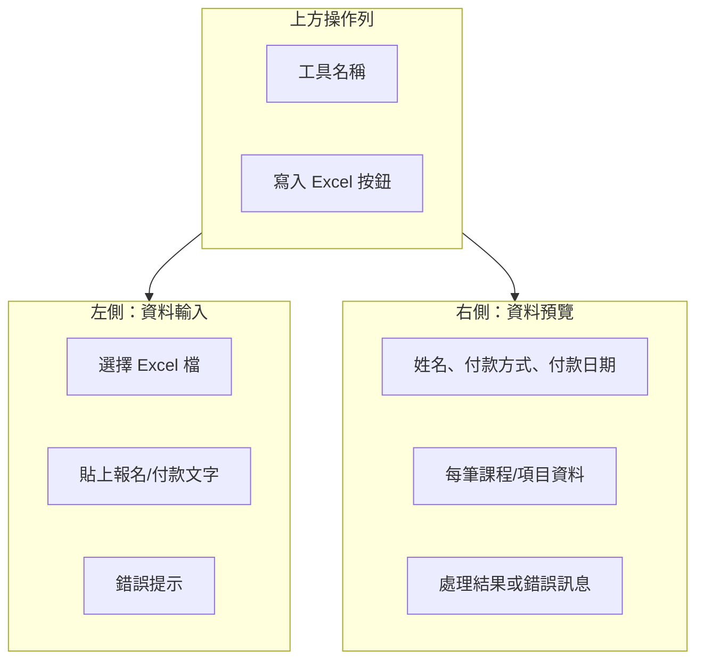
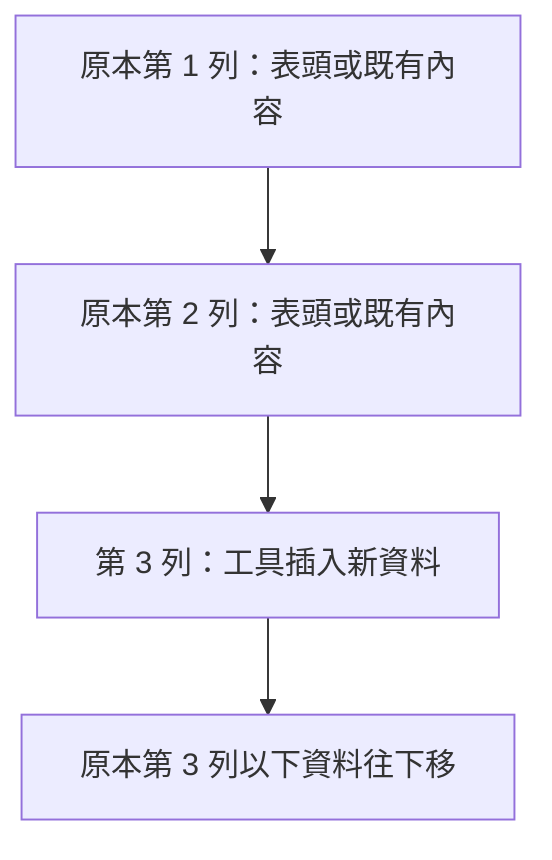

# Excel 報名資料自動填寫工具使用說明

這份說明給一般使用者閱讀。照著做，就可以把報名或付款文字快速整理進 Excel，不需要手動一列一列輸入。

## 這個工具可以做什麼

工具會讀取你貼上的報名/付款文字，先在畫面右側整理成預覽資料，確認無誤後，自動寫入指定的 `.xlsx` Excel 檔案。


## 開始前先確認

| 項目 | 請確認 |
| --- | --- |
| Excel 檔案 | 檔案格式必須是 `.xlsx` |
| 工作表 | 工具會寫入第一個工作表 |
| 表格格式 | 第 3 列會作為新增資料列位置，原本第 3 列以下資料會往下移 |
| 備份 | 第一次使用或正式資料，建議先複製一份 Excel 備份 |
| 檔案狀態 | 寫入前請先關閉 Excel 中正在開啟的同一份檔案 |

> 使用者只需要執行打包後的 `Excel自動填寫工具-0.1.1.exe`，不需要另外安裝 Node.js、Vite 或 Electron。這些工具只會在開發或重新打包時使用。

## 主畫面怎麼看



## 操作步驟

### 1. 選擇 Excel 檔案

在左側「Excel 檔案」區塊按下「選擇」，挑選要寫入的 `.xlsx` 檔。

> 小提醒：如果 Excel 正開著同一份檔案，可能會造成寫入失敗。請先關閉該 Excel 檔後再執行。

### 2. 貼上報名或付款文字

把要整理的報名資料貼到左側大文字框。建議至少包含：

| 資料 | 說明 |
| --- | --- |
| 姓名 | 報名者姓名 |
| 課程/場次名稱 | 可放在第一行，通常會包含日期與課程名稱 |
| 總金額 | 例如 `$10600` |
| 已付金額 | 分期或訂金情境可填 |
| 匯款末五碼或刷卡末四碼 | 用來辨識付款 |
| 付款日期 | 例如 `3/10 匯款`，工具會自動補上年份 |
| 備註 | 原始文字會整理到 Excel 備註欄 |

範例格式：

```text
王小明 2026/6/13-6/14 A課程-B進階班 總金額 $10600
銀行帳號末五碼 40289
已付金額 $4600
-
3/10 匯款
```

### 3. 檢查右側預覽

貼上文字後，右側會顯示工具解析出的內容。

| 預覽欄位 | 你要檢查什麼 |
| --- | --- |
| 姓名 | 是否抓到正確報名者 |
| 付款方式 | 匯款或刷卡是否正確 |
| 付款代碼 | 匯款末五碼或刷卡末四碼是否正確 |
| 付款日期 | 日期是否正確 |
| 課程/項目 | 是否拆成正確筆數 |
| 金額 | 已付金額、課程總額是否正確 |

如果左側出現紅色錯誤提示，代表有必要欄位缺少，請補齊文字後再試。

### 4. 按下寫入按鈕

確認預覽正確後，按上方的「寫入」按鈕。完成後，右側結果區會顯示成功訊息，並告訴你新增了幾筆資料。

## Excel 寫入位置

工具會從第一個工作表的第 3 列開始插入新資料。



## Excel 欄位對照

| Excel 欄位 | 寫入內容 |
| --- | --- |
| A | 月份公式，依付款日期產生 `yyyy-mm` |
| B | 付款日期 |
| C | 付款方式 |
| D | 匯款末五碼或刷卡末四碼 |
| E | 已付金額 |
| F | 姓名 |
| G | 課程/場次名稱 |
| H | 課程總金額 |
| K | 課程月份，優先從課程日期推算 |
| L | 退款註記，工具保持空白 |
| N | 備註 |

## 分期或多項目資料

如果文字內包含多個課程項目或分期資訊，工具可能會拆成多筆 Excel 資料列。

| 情境 | 工具行為 |
| --- | --- |
| 一般單筆付款 | 產生 1 筆資料，收款金額等於課程金額 |
| 多項目付款 | 依項目拆成多筆資料，每筆收款金額等於該筆課程金額 |
| 分期/訂金 | 第一筆會帶入已付金額，其餘筆數可能保留空白付款金額 |

寫入前請一定看右側預覽，確認筆數和金額符合你的期待。

## Excel 公式更新

工具寫入資料後，會要求 Excel 在開啟檔案時重新計算公式欄位，例如分期差額。

如果 Excel 開啟後仍看到舊值，請確認 Excel 的計算選項不是手動模式，或按一次「公式」中的「立即計算」。

## 常見問題

| 狀況 | 可能原因 | 處理方式 |
| --- | --- | --- |
| 寫入按鈕不能按 | 尚未選 Excel，或預覽資料有錯 | 先選 `.xlsx`，再補齊左側文字 |
| 提示缺少姓名 | 文字中沒有明確姓名 | 在第一行最前面放入姓名 |
| 提示缺少付款日期 | 沒有可辨識的匯款日期 | 補上類似 `3/10 匯款` 的文字 |
| 提示缺少付款代碼 | 沒有末五碼或末四碼 | 補上匯款末五碼或刷卡末四碼 |
| 寫入失敗 | Excel 檔案正在開啟或沒有權限 | 關閉 Excel 後再執行，必要時另存新檔 |
| 日期月份不如預期 | 課程名稱中沒有完整日期 | 在課程名稱放入 `2026/6/13` 這類完整日期 |

## 安全使用建議

1. 正式資料第一次使用前，先複製一份 Excel 備份。
2. 每次寫入前先看右側預覽，不要只依賴原始文字。
3. 如果同一份資料重複按寫入，Excel 會重複新增資料列。
4. 寫入完成後打開 Excel 檢查第 3 列起新增的資料是否正確。

## 快速口訣


